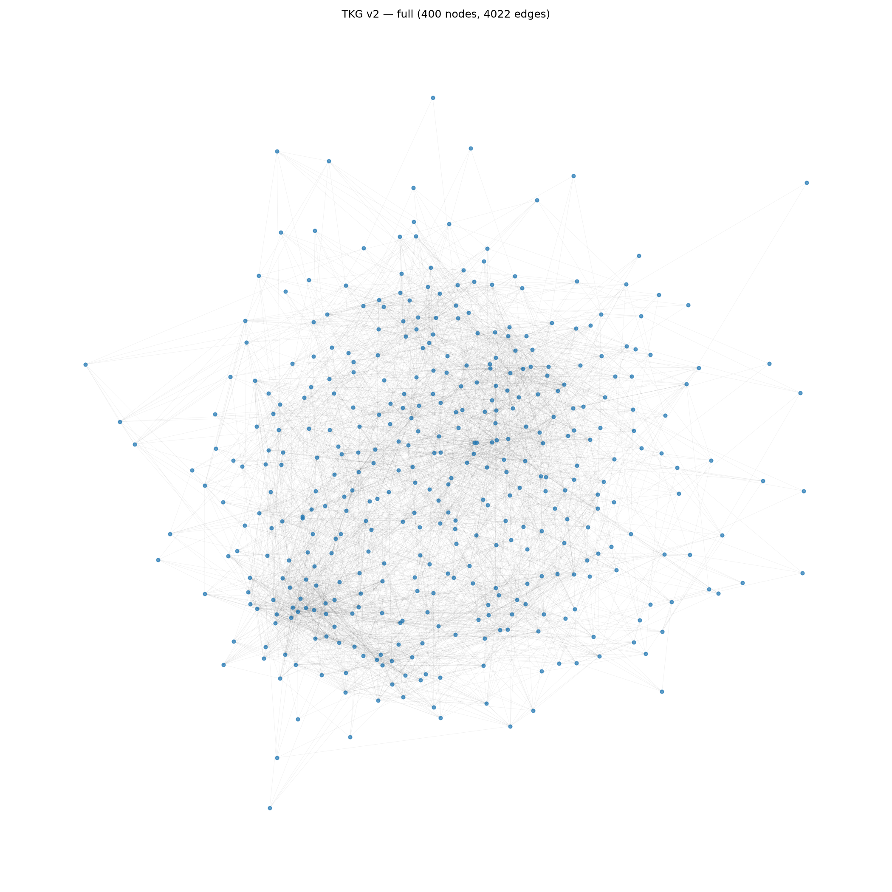
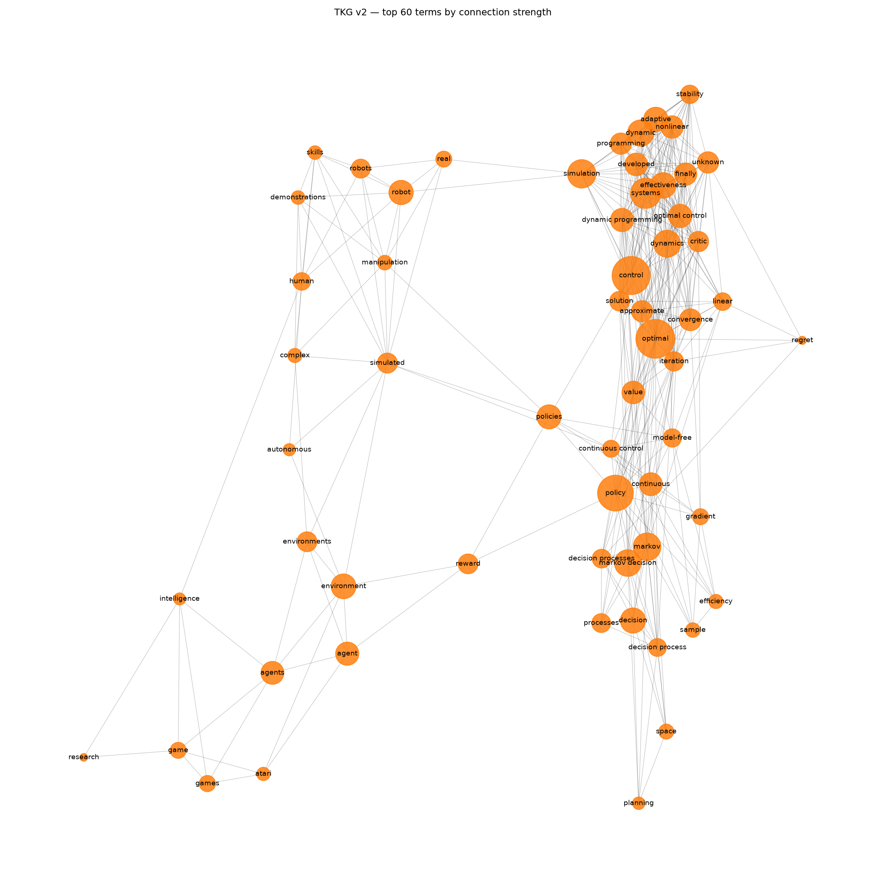
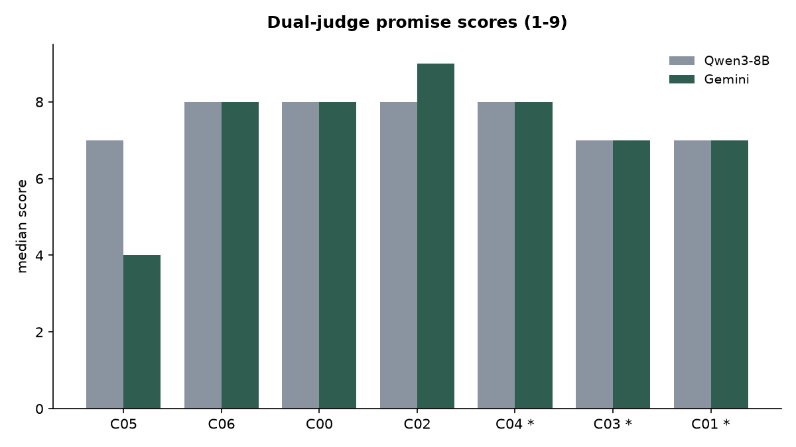
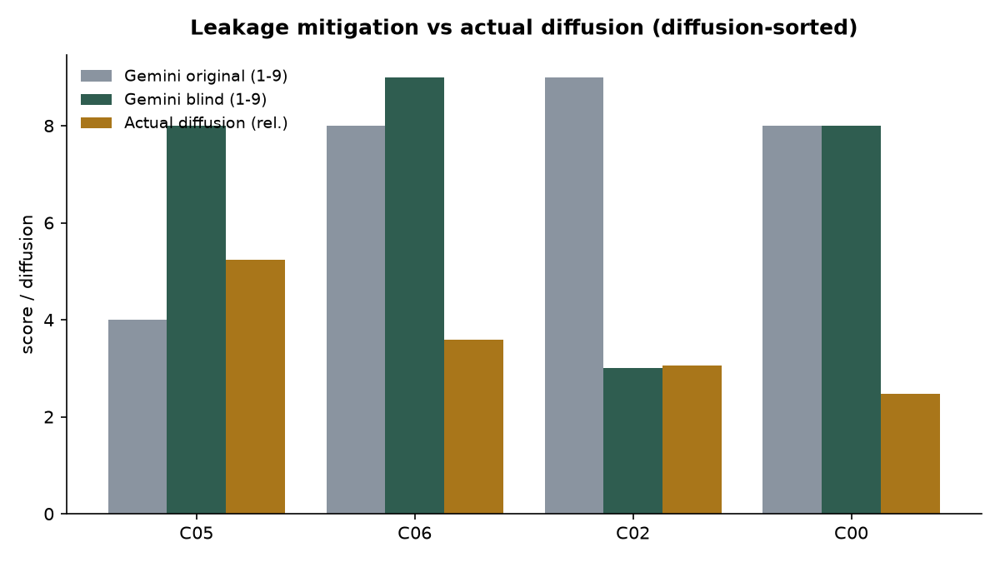
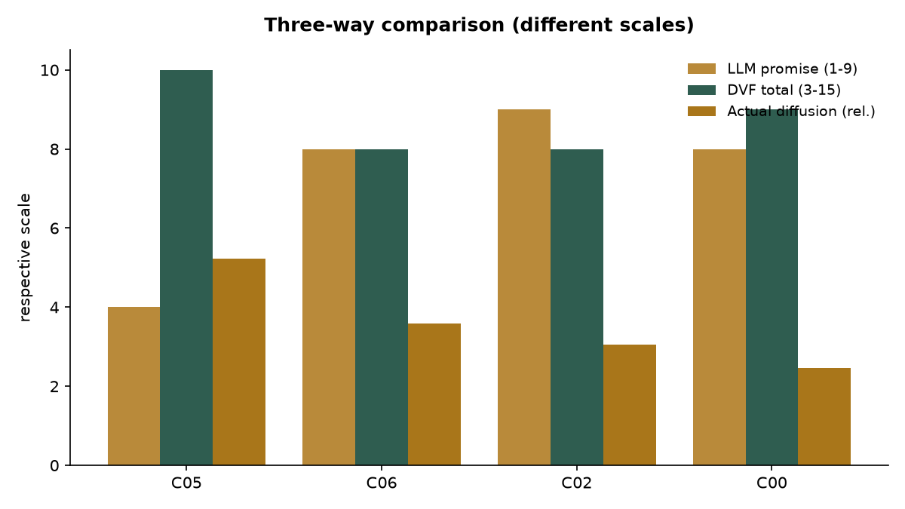

# Prescriptive Technology Opportunity Discovery — Reduced Pipeline with Promise-Judgment Validation


A reduced, free-tier reproduction of a graph-based technology opportunity discovery
pipeline (TKG → link prediction → community detection → concept narration → LLM
promise judgment), extended with three validation experiments the base pipeline does
not include:

1. **Backtest** — checking whether concepts judged "promising" from a past slice
   actually diffused in a later period.
2. **Leakage-mitigation experiment** — re-judging concepts after stripping
   era-identifying cues, to measure how much data leakage distorts LLM judgment.
3. **Data-grounded DVF briefs** — translating top concepts into product-opportunity
   briefs scored on Desirability / Feasibility / Viability, grounded in the measured
   diffusion signal.

Everything runs on free tiers (OpenAlex free key, Gemini free tier, Colab T4). No paid
services are required. **A bilingual (KO/EN) report is in [`index.html`](index.html).**

---

## Domain and time split

- **Domain:** Reinforcement Learning (OpenAlex topic `T10462`).
- **Past slice (build):** 2015–2019, 4,000 works (cited-by-count desc).
- **Future slice (validate):** 2021–2024, used to measure diffusion.
- **Buffer:** 2020 left out to reduce leakage between the two windows.

---

## Pipeline

| Step | File | Runs on | Output |
|---|---|---|---|
| 1. Collect | `src/01_collect.py` | Local | `data/raw/past_works.json` |
| 2. Build TKG | `src/02b_tkg_tfidf.py` | Local | `data/graph/tkg_v2.gexf` |
| 3. Community + link prediction | `src/03_community_linkpred.py` | Local | `exchange/concepts.jsonl` |
| 4. Concept narration | `src/04_describe.py` | Local (Gemini) | `exchange/described.jsonl` |
| 5. Dual-judge promise scoring | `src/05_judge_gemini.py` + `colab/05_judge_qwen.ipynb` | Local + Colab | `exchange/judged_{gemini,qwen}.jsonl` |
| 5b. Judge agreement | `src/05b_judge_agreement.py` | Local | `results/judge_agreement.json` |
| 6. Backtest vs diffusion | `src/06_backtest.py` | Local | `results/diffusion.json` |
| 6b–6d. Leakage experiment | `src/06b_blind_describe.py`, `06c_judge_blind_gemini.py`, `06d_leakage_compare.py` | Local + Colab | `results/leakage_compare.json` |
| 7. Three-way comparison | `src/07_compare.py` | Local | `results/three_way.json` |
| 8. Briefs + DVF | `src/08_brief_dvf.py` | Local (Gemini) | `results/briefs.json` |
| 9. Figures | `src/09_make_figures.py` | Local | `results/figures/*.png` |

> Steps 5 (Qwen) and the Qwen half of 6b run in Colab because they need a GPU for
> Qwen3-8B; everything else runs locally on CPU. The two environments exchange only
> two kinds of file (`described*.jsonl` out, `judged_qwen*.jsonl` back) through the
> `exchange/` folder.

---

## Method notes

### Step 2 — TKG construction
Terms are 1–2 word phrases selected by **TF-IDF** (distinctiveness), not raw frequency,
to keep generic academic words out of the graph. Edges are term co-occurrences filtered
by both a minimum co-occurrence count and **normalized PMI**, so pairs that only
co-occur because both terms are common are dropped. This produced a graph of 400 nodes /
4,022 edges (density ≈ 0.05).

### Step 3 — themes and latent links
Louvain community detection yielded 7 themes. Within each theme, Adamic-Adar link
prediction proposes latent (not-yet-connected) term pairs, which become the "emerging
connection" seeds passed to narration.

### Step 5 — dual-judge design
Each concept is scored for "promise" (1–9) by **two independent judges** of different
scale — Qwen3-8B (local, 4-bit on Colab T4) and Gemini 3.5 Flash-Lite (API) — three runs
each, median taken. Using two judges of different families lets us measure whether the
judgment is stable across models rather than trusting a single one.

### Step 6 — backtest
Each concept is represented by its seed terms; the future-window paper count over the
past-window count gives a raw growth, **normalized by the field-wide growth** (RL as a
whole grew ~1.71× between the windows) to a relative diffusion score. Above 1.0 means the
concept spread faster than the field.

### Steps 6b–6d — leakage mitigation
LLM judges have already seen how 2015–2019 RL played out, so their "promise" scores can
be contaminated by hindsight. Each concept description is rewritten to remove
era-identifying cues (named systems, datasets, success hints), then re-judged. Comparing
original vs blind judgment against actual diffusion measures how much leakage moved the
scores.

### Step 8 — DVF briefs
Top concepts are translated into product-opportunity briefs (target user, job-to-be-done,
MVP, demand signal, feasibility risk) and scored on Desirability / Feasibility / Viability
(1–5 each). Demand and feasibility are grounded in the measured diffusion signal rather
than left to model opinion.

---

## Results

Run `python src/09_make_figures.py` to regenerate the figures below.

**Technology knowledge graph (Step 2).** 400 nodes / 4,022 edges after TF-IDF term
selection and nPMI edge filtering. The top-terms view shows the themes community
detection later separates (classical control · robotics · game/agent RL).




**Dual-judge promise scores.** Most concepts cluster at 7–8; the two judges split only on
C05.



**Leakage mitigation.** Removing era cues moves the large model's judgment toward actual
diffusion — the true top concept C05 rises from 4 to 8, while C02 falls from 9 to 3.



**Three-way comparison.** Data-grounded DVF corrects the leaked judgment: C05, scored
lowest by the original LLM judge, is highest on DVF and first in actual diffusion.



### Data provenance

Every number in the report and figures comes directly from these result files:

| File | Contents | Feeds |
|---|---|---|
| `results/judge_agreement.json` | Two-judge medians; Spearman 0.907, exact-match 71.4%, MAE 0.571 | Fig. `dual_judge` |
| `results/diffusion.json` | Field growth 1.71× (16,468 → 28,173); per-concept past/future n, growth | Backtest table |
| `results/three_way.json` | Judgment vs diffusion, reliability flags | Fig. `three_way` |
| `results/leakage_compare.json` | Original vs blind judgment; ρ sign flip (Gemini −0.63 → +0.32) | Fig. `leakage_mitigation` |
| `results/briefs.json` | Full opportunity briefs + DVF scores | DVF table / briefs |

### Key findings

- **LLM promise judgment has weak discrimination.** Most concepts cluster at 7–8,
  failing to separate concepts whose actual diffusion differed widely.
- **Where the two judges disagreed (C05), the ground truth sided with Qwen.** C05
  (sample-efficient policy optimization) was scored high by Qwen (7) and low by Gemini
  (4); it turned out to be the top-diffusing reliable concept (rel. diffusion 5.23×).
- **Leakage mitigation moved Gemini toward the ground truth.** On the reliable subset,
  Gemini's rank correlation with diffusion flipped from −0.63 (original) to +0.32 (blind).
  Sample is small (n=4), so this is a direction, not a significant result.
- **The larger model was more leakage-prone; the smaller model less discriminating.**
  Gemini swung sharply when cues were removed (game-AI concept 9→3), while Qwen stayed
  flat at 7–8 either way.
- **Data-grounded DVF corrected the leaked judgment.** C05 — scored lowest by the
  original LLM judge — received the highest DVF total (10) and is also the top actual
  diffuser.

---

## Reproduce

### Setup
```bash
python3 -m venv .venv
source .venv/bin/activate
pip install -r requirements.txt
```

Create a `.env` with your free keys:
```
OPENALEX_API_KEY=...
GEMINI_API_KEY=...
```

### Run (local)
```bash
python src/01_collect.py
python src/02b_tkg_tfidf.py
python src/03_community_linkpred.py
python src/04_describe.py
python src/05_judge_gemini.py
python src/05b_judge_agreement.py
python src/06_backtest.py
python src/06b_blind_describe.py
python src/06c_judge_blind_gemini.py
python src/06d_leakage_compare.py
python src/07_compare.py
python src/08_brief_dvf.py
python src/09_make_figures.py
```

### Run (Colab, GPU steps)
Open `colab/05_judge_qwen.ipynb`, mount Drive, run the Qwen loading cell, then the
judgment cells. Upload `described.jsonl` / `described_blind.jsonl` to
`MyDrive/tod/exchange/` first; download `judged_qwen*.jsonl` back to the local
`exchange/` folder before running Steps 5b / 6d.

---

## Layout

```
tod/
├── config.py               # paths, resolved relative to this file
├── requirements.txt
├── .env                    # API keys (gitignored)
├── index.html              # bilingual (KO/EN) report
├── data/
│   ├── raw/                # collected works
│   └── graph/              # TKG (.gexf)
├── src/                    # local steps (01–09)
├── colab/                  # Qwen judgment notebook
├── exchange/               # local <-> Colab boundary files (gitignored)
└── results/                # metrics, comparisons, briefs, figures
```

## Limitations

- **Small sample.** 7 concepts, of which only 4 have enough past-window papers to trust;
  correlation coefficients are unstable and none reach significance. Qualitative reading
  of the table is more reliable than the numbers.
- **Leakage is mitigated, not removed.** A concept is itself an era identifier, so
  stripping named cues only partially blinds the judge.
- **Seed-term specificity.** Low-count concepts (C04, C01, C03) have noisy growth ratios
  and are flagged low-confidence throughout.
- **Single domain, reduced pipeline.** One RL subfield; heavier components of the
  original method are replaced with lightweight equivalents to stay on free tiers.